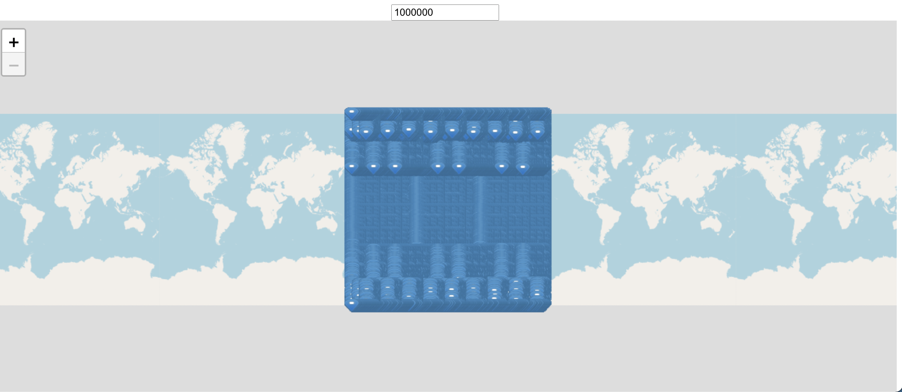

1 Million Markers

## Installation 
[npm package](https://www.npmjs.com/package/@simerca/vue2-leaflet-marker-canvas)

`npm i @simerca/vue2-leaflet-canvas-marker`

## Use

```html
<template>
    <LMap>
        <LTileLayer :url="https://tile.openstreetmap.org/{z}/{x}/{y}.png">
        <LCanvasMarker :markers="markers"/>
    </LMap>
</template>
```

```js
import L from leaflet;
import {LMap, LTileLayer} from 'vue2-leaflet';
import {LCanvasMarker} from 'vue2-leaflet-canvas-marker';
export default {
    computed:{
        markers(){
            let markers = []
            for(var i = 0; i < 1000; i++){
                let lat = Math.random()*360 - 180
                let lng = Math.random()*360 - 180
                var icon = L.icon({
                    iconUrl: 'img/marker-icon.png',
                    iconSize: [20, 18],
                    iconAnchor: [10, 9]
                });
                markers.push(L.marker([lat, lng], {icon:icon}).bindPopup(`Hello ${i}`))
            }
            return markers
        }
    }
    components:{
        LMap,
        LTileLayer,
        LCanvasMarker
    },
}
```

## Your welcome !